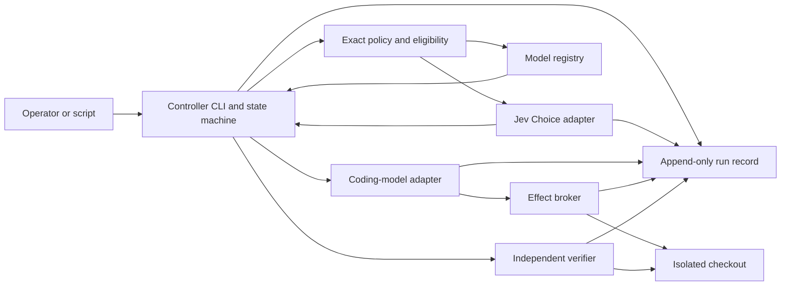

<!-- doc-governance: essential; canonical: self; checked: 2026-10-04 -->
# Jev Orchestration Harness — Product Requirements Specification

> Status: DRAFT LIVING DOCUMENT · Intended behavior only, except where marked observed · Created: 2026-10-04
> Companion: [PRD-Jev-Orchestration-Harness.md](PRD-Jev-Orchestration-Harness.md). No section has been ratified.

## 1. Introduction & scope

### 1.1 What this document is

This PRS specifies the proposed Release 1 technical contract for the **Jev Orchestration Harness**, a cross-project internal tool. The [PRD](PRD-Jev-Orchestration-Harness.md) owns product intent. It distinguishes implemented experimental behavior from remaining requirements and must be updated to the final as-built contract at handoff. `jev_harness.py` owns the observed one-Choice adapter. `local_model.py` has a bounded OVMS client and probe. `orchestrate.py` has a one-task controller, generated two-model configuration, isolated source copy, constrained file replacement, and Docker evaluator. `tools/setup_ovms.ps1` supplies pinned Windows server/model preparation outside the controller. The observed controller CLI does not include general task import, an independent broker command, or Jev promotion. [Current Jev CLI](../README.md), [study protocol](coding-decision-study.md). (JOH-1–JOH-8)

### 1.2 Governing decisions

No ADR for this new product is ratified. Release 1 selects OpenVINO Model Server (OVMS) 2026.4.0 for local coding inference on Windows and a pinned Docker Linux image for generated-code execution; the host repository still needs a durable-record storage decision. Do not infer an ADR number or treat the routes in the empirical study as approved production policy. Reversible numeric limits live in validated configuration within code-defined bounds. [OVMS Windows installation](https://docs.openvino.ai/2026/model-server/ovms_docs_deploying_server_baremetal.html), [OpenAI-compatible text API](https://docs.openvino.ai/2026/model-server/ovms_docs_llm_quickstart.html). (JOH-2, JOH-4, JOH-7, JOH-8)

### 1.3 Out of scope for this PRS

This release does not specify the Jev Brain vault, a hosted service, tenant sharing, automatic repair, a scheduler, Laya inference, or production deployment. Later profiles for failure triage, plan criteria, and test gaps require their own held-out evidence and spec revisions. (JOH-2, JOH-4, JOH-8)

### 1.4 Document conventions

`JOH-n` cites a PRD capability. **Observed** means supported by the existing harness and cited code or command evidence. **Intended** means a requirement for this new release, not a completion claim. `TaskManifest` is the canonical task definition; `DecisionProfile` is the canonical Jev rubric; `RunEvent` is the canonical execution record. For a study task, the versioned study manifest is its `TaskManifest`; a run uses a hash-verified snapshot, not a separately edited copy. A generated view or report is never a second owner. Status names and route names below are protocol values, not synonyms. (JOH-1, JOH-2, JOH-6)

## 2. System architecture overview

**Intended:** A local CLI calls a code-owned controller. The controller calls validation, routing, a registered coding-model adapter, an effect broker, and a verifier through direct interfaces. Each component also exposes a CLI command for a person or script. Jev performs inference *inside* the decision adapter; no model carries data between components. A selected model never receives authority to alter its own route or verification contract. (JOH-1–JOH-7)



**Observed:** `jev_harness.run_one` validates a version-pinned Choice response, writes an audit, and returns `accept` or `review` as a recommendation. Its `replay` recomputes that policy from a saved response. `orchestrate.run` can call it with a small approved route packet or use `--jev-mode off` for a rules-only baseline. It selects the baseline route by default, then invokes a fixture response or `local_model.chat_completion`. The controller accepts only strict JSON full-file replacement for declared files, runs the protected evaluator in a pinned Docker container, and writes a per-run event ledger. An audit reproduced a candidate `os._exit(0)` false green against the prior evaluator. The current evaluator invokes candidate code in a child process and emits a trusted JSON test verdict; the controller requires a positive test count and zero failures/errors. Replay also checks a trusted evaluator snapshot, saved model output, patch artifact, checkout, and restore proof. Current-format [30B interval](../evidence/orchestration-proof-interval/runs/87f75c56-e81b-4e12-9676-6f9f9c541921/events.jsonl) and [7B add](../evidence/orchestration-proof-add/runs/54cf2c0e-dc53-417a-bf8f-bb51675d1472/events.jsonl) runs both passed replay; pre-hardening records remain historical demonstrations. [Jev source](../jev_harness.py), [controller source](../orchestrate.py), [local client](../local_model.py). (JOH-1–JOH-7)

**Intended Release 1 topology:** one local controller process controls one task at a time. A fixture backend supports a complete offline run. The live coding adapter talks only to configured loopback OVMS endpoints, with no inherited HTTP proxy or redirect, and identifies the exact local model artifact and device. Live Jev and coding-model calls require explicit configuration and watched smoke evidence. No background queue or schedule exists. **Observed local inference:** Windows reports an Intel Core Ultra 7 265K, integrated graphics, and Arc Pro B70. A separately installed OVMS 2026.4.0.869b2186 process initially reported `CPU, GPU.0, GPU.1, NPU` and selected its single discrete `GPU.1`; its bounded 7B `local_model.py probe` returned `LOCAL_MODEL_PROBE_OK`. A later read-only [OpenVINO C API device query](build-tasks/jev-orchestration-harness/evidence/ovms-device-map.md) identified `GPU.1` by full device name as Intel Arc Pro B70; the running fast OVMS process explicitly targeted `GPU.1` and loopback port 8766. The [installed fast root verification](build-tasks/jev-orchestration-harness/evidence/ovms-fast-verify.json) passed pinned archive/model checks. That port answered the current-format [experimental Jev-routed 7B add run](../evidence/orchestration-proof-add/runs/54cf2c0e-dc53-417a-bf8f-bb51675d1472/events.jsonl) with [three-test verdict](../evidence/orchestration-proof-add/runs/54cf2c0e-dc53-417a-bf8f-bb51675d1472/verifier.stdout). A separate 30B server answered the [interval-merge run](../evidence/orchestration-proof-interval/runs/87f75c56-e81b-4e12-9676-6f9f9c541921/events.jsonl) with [six-test verdict](../evidence/orchestration-proof-interval/runs/87f75c56-e81b-4e12-9676-6f9f9c541921/verifier.stdout). This is a correlated fast-model B70 inference chain, not controller-side per-run binding of server PID/device/artifact digest. (JOH-1, JOH-3–JOH-7)

The observed client command ran from the deliverable root after `local_model.py` was created; its unedited stdout was:

```text
python -B local_model.py probe --endpoint http://127.0.0.1:8765/v1/chat/completions --model qwen25-coder-7b-int4 --max-tokens 64 --timeout-seconds 120
{"content": "LOCAL_MODEL_PROBE_OK", "model": "qwen25-coder-7b-int4", "status": "ok", "usage": {"completion_tokens": 6, "prompt_tokens": 38, "total_tokens": 44}}
```

## 3. Data model

| Entity and canonical owner | Minimum contract | Failure rule | Capabilities |
| --- | --- | --- | --- |
| `TaskManifest` in an immutable task registry | Schema version, task ID, base commit, objective, operator-approved routing summary, data/egress class, allowed paths/tools, provider destinations, model eligibility constraints, budgets, trusted evaluator commands and test hashes, non-test acceptance criterion or explicit `none` | Reject missing or contradictory fields before a model or tool call. Never infer permissions from the task prose. | JOH-1, JOH-3, JOH-4, JOH-5, JOH-7 |
| `DecisionProfile` in immutable versioned configuration | Profile ID/version, Jev model ID, one Choice question, ordered labels and criteria, allowed state fields, policy thresholds, `candidate|shadow|active|disabled`, study evidence reference | Reject unknown fields, moving model aliases, unapproved state, or active status without the recorded promotion gate. | JOH-2, JOH-3, JOH-8 |
| `BaselinePolicy` in immutable versioned configuration | Ordered rules over the approved route feature packet, stable route labels, model mapping, and explicit `review_required` outcome | Select only an eligible mapped model. If no rule yields one, require review; never choose a hidden default. | JOH-1, JOH-3, JOH-8 |
| `ModelRegistration` in versioned configuration | Stable route model ID, OVMS-exposed model name, exact Hugging Face revision and artifact manifest hash, `ovms` version, resolved device ID, loopback destination, allowed operations/data classes, context and output bounds | Compute eligibility before any route. Reject moving revisions, hash mismatch, unverified device mapping, or unavailable model. The Jev Choice labels remain fixed for a profile version; a selected label mapped to an ineligible model becomes `review_required`. | JOH-3, JOH-7 |
| `StepPlan` in the controller | Step ID/kind, canonical input hash, task cap snapshot, allowed effects, destination/model, policy/profile versions, one-use execution permit | Recompute or reject after any input or policy change. No step inherits wider scope than its task. | JOH-2, JOH-4, JOH-7 |
| `RunEvent` in an append-only run ledger | Task/run/step IDs, event kind, safe input/output hashes, actual model ID, config versions, Jev audit reference, tool/test command, exit code, protected evidence reference, failure code and next action | An event write failure stops before the next effect and cannot produce `completed`; link the existing Jev audit rather than copying its response. | JOH-5, JOH-6 |
| `ReviewResolution` in the append-only run ledger | Reviewer ID, source run ID, route or acceptance question, chosen eligible model or acceptance disposition, rationale, timestamp, linked new run ID | Cannot waive a failed or missing evaluator check or mutate the prior run. | JOH-3, JOH-5, JOH-6 |
| `PatchArtifact` in immutable run output | Base commit, patch or file snapshot, content hashes, producer step and permitted path set | A generated checkout is rebuildable from the base and this artifact; no patch can modify an undeclared path. | JOH-4, JOH-5, JOH-6 |

The task manifest owns task facts. Repository history owns the base source. The model registry owns the selected artifact revisions and checked local hashes. The run ledger and patch artifact own observations and produced changes. Reports and dashboards are derived by a shipped rebuild command. Harness credentials are never stored in a manifest, profile, event, patch metadata, or report. Unedited output stays in restricted evidence storage and may require quarantine. (JOH-3, JOH-6, JOH-7)

**Observed schema subset:** `orchestrate.initialize` generates one `task.json`, `orchestration.json`, route profile, route fixture, coding fixture, protected evaluator, and tiny Git repository. New [model-pins.json](../model-pins.json) owns both model IDs, full HF revisions, expected byte counts, file counts, weight digests, and parser names. `init` derives task registrations from it, and `load_state` rejects identity/revision drift in generated config. The controller still does not check installed artifact hashes, OVMS version, or inference device at run time. The task has one protected `evaluator_sha256` and 1–4 allowed text files. New run records contain config/task snapshots, Jev audit reference, trusted evaluator snapshot, full model response in restricted output, patch artifact and changed-file hashes, Docker command, and unedited verifier streams. `StepPlan` one-use permits, a separate broker CLI, arbitrary task import, and a report rebuild command remain intended rather than observed. [Controller validation and run](../orchestrate.py). (JOH-1, JOH-3–JOH-7)

## 4. Core engines / state machines

**Intended task lifecycle:** `created → validated → routed → executing → verifying → completed`. From `validated`, `routed`, `executing`, or `verifying`, a failed dependency or violated bound enters `failed`. An uncertain semantic route or acceptance condition enters `review_required`. Both terminal states retain the last completed step and next action. A dry-run validates and describes intended effects without changing task or run state. A review resolution creates a linked new run; it never edits the terminal record. (JOH-1, JOH-3–JOH-6)

1. The controller validates the task, config, base commit, required commands, credential setting names, and budget. It creates an isolated checkout from the pinned base. Before its first write, it regenerates the base tree in scratch and compares its hash as a tested restore path. A live run never edits the operator's current working checkout. (JOH-1, JOH-4, JOH-7)
2. Exact policy computes the eligible model set from data class, source permissions, provider egress, task risk, and budget. A disallowed source, destination, path, tool, or model stops here. This computation never depends on Jev. (JOH-2, JOH-3, JOH-7)
3. A versioned `BaselinePolicy` owns the route for fixture tasks and while Jev is candidate, shadow, or disabled. Its deterministic rules choose one model from the eligible set or return `review_required`; its inputs, rule ID, eligible set, and outcome enter the run record. Candidate or shadow Jev receives the same frozen route feature packet for comparison but cannot control the route. If the shadow call fails, the run records that failure and stops rather than presenting a complete comparison. (JOH-1–JOH-3, JOH-8)
4. An active Jev profile receives one approved Choice state with fixed ordered labels and a versioned label-to-model map. The eligible set is an input field, not a dynamic change to the label list. `unclear`, tied, below-threshold, unmapped, or ineligible selections become `review_required`. A provider error is `failed`, not `unclear`. The controller binds a valid route to a one-use `StepPlan`. Release 1 permits at most one Jev route call and one coding-model attempt per run. The broker enforces paths, tools, network destinations, and remaining budget at execution time. (JOH-2–JOH-4, JOH-7)
5. The verifier runs immutable evaluator commands and tests held outside the coding model's writable scope against the produced artifact. It checks the evaluator hashes and captures each command, exit code, and unedited output in restricted evidence storage. If ordinary project tests were editable, their pass alone cannot establish completion. `completed` requires every trusted evaluator command to pass, plus a passed non-test acceptance criterion when the manifest declares one. A criterion can be a trusted checker or a named reviewer disposition. If an implementation fails, a later repair is a new explicit run with the failure record; Release 1 does not start a hidden repair loop. (JOH-4–JOH-6)

`review resolve` records a named reviewer decision. For an uncertain route, it names an eligible model and starts a new bounded run under the same manifest. That linked run uses the recorded reviewer route as its route source, without repeating the uncertain Jev call. For non-test acceptance, it links the existing immutable patch to a new verification run that repeats all trusted checks before it can report `completed`. A reviewer cannot waive a failed check. (JOH-3, JOH-5, JOH-6)

The controller validates every transition. One Jev response can affect only the next bounded route step. It cannot add steps, enlarge permissions, execute a tool, skip a test, or assert completion. Several later atomic Jev judgments, if introduced, must each have a fresh validated input and a code-owned tie/conflict rule; unbounded Jev arbitration is excluded. (JOH-2–JOH-5, JOH-7)

**Observed routing limit:** `orchestrate.run` accepts `--route-source baseline|jev`; baseline is the default. `--jev-mode off` calls no Jev and yields a clean rules-only control arm, while `fixture|live` Jev modes observe one Choice result even when the baseline controls the route. A live Jev-controlled route requires `--experimental-jev-route` and interactive `--watch`, but no held-out promotion gate exists in code. Treat that flag as a one-run experiment, not activation. An `unclear`, low-margin, or ineligible Jev route becomes `review_required` before model execution. The current program has no `review resolve` command; a reviewer starts a new run after changing validated task/configuration outside the run record. [Controller route code](../orchestrate.py). (JOH-2, JOH-3, JOH-6, JOH-8)

## 5. Integration adapters

### 5.1 Jev decision adapter

**Observed:** The current harness accepts one textual Choice profile per call and exact config fields. `run_one` persists the full input and request, then sends the state to TypeSafe in live mode. [Source](../jev_harness.py). **Intended:** an adapter builds a valid harness config from one immutable `DecisionProfile` and sends only a size-bounded allowlist of locally derived task fields. The packet can include the operator-approved, frozen task summary after source and egress admission. Baseline, Jev, and study LLM routers receive the same packet for a paired comparison. Raw source, logs, prompts, URLs, headers, tool arguments, and credentials are excluded by default. A profile that needs unapproved context cannot be assessed and enters `review_required` before egress. New Noul, Score, or multiple-question support requires a separately tested contract change. (JOH-2, JOH-6–JOH-8)

The adapter pins `jev-1.13.0` for the initial candidate profile and validates the returned version. Aliases may move. A provider timeout, bad credential, malformed distribution, model mismatch, or audit error records a safe failure and stops the step. The existing demo thresholds do not become routing thresholds. [TypeSafe models](https://docs.typesafe.ai/models), [API](https://docs.typesafe.ai/api). (JOH-2, JOH-3, JOH-6, JOH-8)

### 5.2 Coding-model adapter

**Intended:** The local adapter exposes a direct CLI and a typed request/response contract for OVMS 2026.4.0 `chat/completions`. The registry fixes the OVMS-exposed model name, Hugging Face revision, checked artifact hashes, generation parameters, and device before a task starts. [model-pins.json](../model-pins.json) is the observed canonical owner of the two OpenVINO INT4 model IDs and revisions, for Qwen2.5-Coder-7B-Instruct and Qwen3-Coder-30B-A3B-Instruct; generated controller registrations derive from it. The 7B artifact answered a local synthetic probe and a watched add coding task; the 30B artifact answered watched arithmetic and interval-merge coding tasks. These observations do not establish comparative coding quality because the watched model tasks differ. The 30B model's [OVMS example](https://docs.openvino.ai/2026/model-server/ovms_demos_code_completion_vsc.html) recommends 19 GB or more GPU VRAM, so a resource check must precede download and load. [7B model card](https://huggingface.co/OpenVINO/Qwen2.5-Coder-7B-Instruct-int4-ov), [30B model card](https://huggingface.co/OpenVINO/Qwen3-Coder-30B-A3B-Instruct-int4-ov). (JOH-3, JOH-4)

The adapter receives only the approved task and tool scope, records request ID, returned model identity, usage, response hash, latency, and safe failure, then emits proposed patch text or an explicit no-change result. It cannot call Jev or another coding model to choose a new route. `model prepare` fetches a pinned revision to a content-checked local cache through a bounded, visible operation; an existing artifact with a mismatched hash is never silently replaced. `model smoke --watch` sends the same bounded prompt to each of the two registrations, one at a time, and records whether the response was actual local inference. The fixture adapter works without OVMS or credentials. [OVMS API and readiness example](https://docs.openvino.ai/2026/model-server/ovms_docs_llm_quickstart.html). (JOH-1, JOH-3, JOH-4, JOH-6, JOH-7)

**Observed client:** `local_model.chat_completion` sends one bounded non-streaming loopback request, validates a matching response model, completed content, and consistent token usage, and blocks proxies, redirects, remote hosts, and retries. Its only current CLI command is `probe`, which sends a synthetic prompt. `orchestrate.run --mode live` calls the importable function directly with the selected registration. It does not yet validate artifact hashes, OVMS version, or device; those facts must come from the separate server preparation record. [Client source](../local_model.py), [client tests](../tests/test_local_model.py). (JOH-3, JOH-4, JOH-6, JOH-7)

The GPU smoke obtains OpenVINO device names and properties, maps the Arc Pro B70 to a concrete `GPU.<index>`, and starts OVMS with that explicit target. It retains the device-query output, server version/start command and unedited startup output, model readiness response, and client request/response evidence. The fast server now has a direct `GPU.1` → Arc Pro B70 full-name query and a running `--target_device GPU.1` command line, with a local 7B coding response at its loopback port. The controller still needs a per-run server/device/artifact evidence reference to make that proof durable and automatically checked. A generic `GPU` setting, model readiness alone, CPU fallback, or Windows Device Manager detection cannot prove B70 inference. If mapping or load fails, record `failed` and say what to fix; do not relabel CPU output as GPU. [OVMS device parameter](https://docs.openvino.ai/2026/model-server/ovms_docs_parameters.html), [OpenVINO device naming](https://docs.openvino.ai/2026/openvino-workflow/running-inference/inference-devices-and-modes.html), [C API property query](https://docs.openvino.ai/2026/api/c_cpp_api/group__ov__core__c__api.html). (JOH-3, JOH-6, JOH-7)

### 5.3 Effect broker and verifier

**Intended:** The broker receives a one-use permit tied to the exact step, model, input hash, policy, and scope. It resolves paths and network destinations at execution time; unknown tools and opaque effects stop. Its direct CLI applies the same permit checks as the controller. An optional Codex hook can observe calls but is not the mandatory enforcement boundary. The verifier receives exact immutable commands and evaluator material from the manifest, not from the coding model. Its direct CLI enforces the same scope. It runs generated code and trusted checks only inside a Docker Linux sandbox using `docker.io/library/python@sha256:b921fe7e7522f828d45197a47656ec465a9b15689b27fa8e1fba2864fca5b967` (Python 3.14.6 slim amd64), with network disabled, read-only root filesystem, all Linux capabilities dropped, and the checkout mounted only at its approved location. It keeps complete output in restricted evidence storage. Before replacing or cleaning a derived checkout, a regenerate command recreates it in scratch from the base commit and patch artifact and compares hashes. Docker image presence alone does not prove these run flags were enforced; the actual command and output must be retained. (JOH-4–JOH-7)

**Observed bounded effect path:** `orchestrate._parse_patch` accepts only strict JSON with full UTF-8 content for existing declared files; `_apply_patch` replaces those files inside the generated isolated checkout after path and symlink checks. It does not use `git apply`, execute model-supplied shell commands, or provide a general tool broker. `_verify_docker` runs the protected evaluator with the pinned image, network disabled, read-only root and checkout, dropped capabilities, unprivileged user, time/output limits, and unedited stdout/stderr files. A scratch base-tree copy is compared before the first write. No shipped command yet regenerates a modified checkout from base plus patch for later replacement. [Controller source](../orchestrate.py), [integration test](../tests/test_orchestrate.py). (JOH-4–JOH-7)

### 5.4 Alternative backend

Laya is not a Jev endpoint. A future adapter must pin its local model bundle and runtime, reject its shorter input overflow before inference, and pass separate quality and calibration tests. It is not a fallback after a Jev failure. [Receptron Laya](https://github.com/receptron/laya). (JOH-2, JOH-8)

## 6. Surface / view specifications

**Observed controller CLI:** `python -B orchestrate.py --help` lists `init`, `dry-run`, `run`, `demo`, `inspect`, and `replay`. `init --directory [--fixture-complexity simple|complex] [--fast-endpoint URL] [--strong-endpoint URL]` creates a Git fixture, protected evaluator, two pinned model configuration entries, Choice profile, and fixtures. The distinct loopback endpoint defaults are ports 8000 and 8001. `dry-run --directory --mode fixture|live --jev-mode off|fixture|live` prints one-task effects without a model, checkout, or provider call. `demo --directory` runs fixture Jev plus fixture model through Docker verification. `run --directory --mode fixture|live --jev-mode off|fixture|live [--route-source baseline|jev]` handles one task; either live mode requires an interactive terminal, `--watch`, displayed scope, and typed `yes`. `--dotenv` supplies a configured Jev credential only for live Jev mode. A live Jev-controlled route additionally requires `--experimental-jev-route`. `inspect --run-dir` and `replay --run-dir` read saved runs. `local_model.py` separately exposes only `probe` at present. [Controller CLI source](../orchestrate.py), [local CLI source](../local_model.py). (JOH-1–JOH-7)

Successful controller commands emit JSON; failures return nonzero with a safe code and next action. The current live gate checks interactive acknowledgement but does **not** require a prior demo, two model smokes, or held-out Jev promotion evidence. The current run record does not prove the local model's device or artifact hash. `tools/setup_ovms.ps1` has bounded `-Action dry-run|install|serve|verify -Model fast|strong` actions with separate installation roots and loopback ports. It reads canonical [model-pins.json](../model-pins.json). Both post-migration [fast](build-tasks/jev-orchestration-harness/evidence/ovms-fast-dry-run-post-pins.json) and [strong](build-tasks/jev-orchestration-harness/evidence/ovms-strong-dry-run-post-pins.json) dry-runs passed, fast install/serve succeeded, and [read-only fast verify](build-tasks/jev-orchestration-harness/evidence/ovms-fast-verify.json) passed; the strong script installation path remains untested. These setup actions are not controller subcommands. The intended later CLI still includes validated in-controller model registration, task import, direct broker/verifier commands, review resolution, study evaluation, recovery, device inspection, and a real promotion gate. Those commands do not exist in the observed controller. (JOH-1, JOH-3, JOH-6–JOH-8)

## 7. Calculation specifications

**Decision policy:** The existing Choice policy accepts a label only when it is not a review label, its selected probability meets the configured minimum, its margin over the runner-up meets the configured minimum, and the top label is not tied. This is a deterministic mapping of a saved distribution. The route still passes eligibility and profile-status checks. Jev `confidence` is recorded as distribution information, not a correctness probability. Historical replay reproduces this mapping; it does not prove identical fresh inference. [Harness `decide`](../jev_harness.py), [confidence definition](https://docs.typesafe.ai/confidence). (JOH-2, JOH-3, JOH-6)

| Reported value | Exact definition | Capabilities |
| --- | --- | --- |
| `verified_completion` | True only if every trusted evaluator command ran with exit code zero, its protected unedited output is present, evaluator files and command hashes match the manifest, and each declared non-test acceptance criterion passed. Explicit `none` means no such criterion. Otherwise false or `incomplete`, with the reason. | JOH-5, JOH-6 |
| `selected_route_probability` | Provider probability attached to the selected Choice label; keep separately from Jev `confidence`. | JOH-2, JOH-3 |
| `route_abstention_rate` | Number of `review_required` or `unclear` route outcomes divided by all tasks with valid route-decision responses in the stated dataset; report invalid/provider failures separately. | JOH-3, JOH-8 |
| `modeled_provider_cost` | Recorded input/output token usage for routing and coding calls multiplied by the frozen, versioned per-model price schedule. Include retries and escalations. Missing material usage makes this estimate unavailable. | JOH-6, JOH-8 |
| `observed_provider_bill` | Actual billed amounts when a provider supplies them; display separately for reconciliation. Absence is `unavailable`, not zero, and does not replace measured usage. | JOH-6, JOH-8 |
| `modeled_compute_and_review_cost` | Measured executor and verifier time plus recorded human review minutes, each multiplied by its frozen configured rate. Display the terms separately. Missing material time data makes the estimate unavailable. | JOH-6, JOH-8 |
| `all_in_cost_per_verified_completion` | Sum of modeled provider, compute, verification, and reviewer costs across all assigned tasks, including retries and escalations, divided by the number with `verified_completion=true`. Mark inconclusive if a material input is missing or the denominator is zero. | JOH-8 |

The [Coding Decision Study](coding-decision-study.md) owns the comparison estimator, confidence bounds, and predeclared promotion margins. Release 1 records the required inputs but does not claim a routing advantage before the study runs. (JOH-8)

**Observed calculation subset:** The current `completed` event requires the pinned protected evaluator process to exit zero **and** an exact trusted stdout verdict with `schema_version=1`, `tests_run` in 1–1000, `failures=0`, and `errors=0`; it records unedited stdout/stderr hashes and the parsed verdict. `replay` revalidates that verdict, saved artifacts, and historical route. The prior version accepted exit zero alone; candidate `os._exit(0)` reproduced a false green, then the same focused regression passed after child-process isolation and verdict validation. Old runs lack newer evidence and are rejected by current replay. Current-format watched 30B interval and 7B add runs each emitted a passing trusted verdict and replayed. The final [96-test suite](build-tasks/jev-orchestration-harness/evidence/tests-final.txt) passed. The controller does not yet implement non-test acceptance criteria, multi-command verification, all-in cost, calibration, held-out profile scoring, or promotion. The two different tasks demonstrate bounded successful execution, not routing quality. (JOH-5, JOH-6, JOH-8)

## 8. Configuration & console

**Intended:** Versioned configuration owns provider endpoints and credential setting names, two initial model registrations with immutable artifact revisions and hashes, exact OVMS package version and checksum, resolved Intel device target, baseline rules, profile rubrics and ordered labels, route mapping, thresholds, permitted data classes and destinations, paths, timeouts, per-step/per-run caps, and frozen cost rates. Code owns schema and every valid range. The OVMS destination must be loopback; its port is a validated setting. `config validate` rejects unknown fields, invalid ranges, moving aliases, artifact hash mismatch, conflicting routes, unrecognized device mapping, and missing required settings by name. A key value enters through the named credential source and never appears in configuration, routine output, or audit metadata. (JOH-1–JOH-4, JOH-6–JOH-8)

`init` supplies a complete fixture configuration and pinned runtime/dependency set. A config change creates a new version; an active run keeps the version it started with. The profile registry changes only through explicit `candidate → shadow → active → disabled` transitions. `active` requires a decision-specific held-out evidence reference and the owner-approved promotion rule. The exact promotion threshold and coding-model IDs remain open until the pilot and ADR decisions; the first fixture run needs neither secret nor hand-created state. (JOH-1–JOH-3, JOH-8)

## 9. Security & access model

**Intended:** Release 1 runs for one local operator under OS file permissions. Every external request has an explicit destination and approved field set. A source's egress class is resolved from trusted metadata, not from a coding model's claim. The controller rejects a task that asks an unapproved provider to receive source text. Jev receives only approved structured features; a heuristic claim that text is “safe” cannot grant egress. (JOH-4, JOH-7)

The broker enforces tool, path, network, and secret rules inside the execution path before side effects. A model label cannot change those rules. Shell/interpreter tools with ambient credentials or unrestricted network are outside Release 1's allowed effects. The operator's original checkout is read-only to the run; all writes occur in an isolated checkout built from a pinned base commit. A scratch reconstruction is hash-checked before the first write and before any later replacement of a derived checkout. Patch artifacts and the base commit form its tested restore path. No canonical task, config, audit, or patch record is overwritten or deleted by Release 1 commands. (JOH-4, JOH-6, JOH-7)

Provider payloads and audits can contain approved task information. The executor receives no credential environment variables or secret mounts; provider keys stay in the controller-side adapter. The run ledger records hashes and safe identifiers. Unedited tool and test output is stored with restrictive local permissions, separate from default `inspect` output. If an output scan detects a possible credential, the raw evidence is quarantined, the run fails, and the report names the evidence location without printing the value. A tool response withheld from model context has explicit `blocked` status; no partial text is presented as a successful full response. A failed audit, missing permit, unknown tool, or unresolved destination stops the run. Multi-user tenancy, remote access control, and production secret handling require a later security design. (JOH-6, JOH-7)

## 10. Deployment topology

**Observed:** The original Jev-only harness is a Python CLI with no third-party runtime dependency and a pinned Python version. The new controller has current-format completed fixture and watched local 30B interval-merge runs, plus a watched 7B add task selected by one live experimental Jev route. The pinned Docker verifier reported six and three protected tests, respectively, with trusted verdicts; replay passed both at the original workspace. The copied records are archival and require new runs for replay in this project folder. A prior 30B run failed strict patch parsing when the model added a Markdown fence. The two models have not yet been compared on the same coding task. `python -B -m unittest -v` exited 0 with [unedited output showing 96 tests and `OK`](build-tasks/jev-orchestration-harness/evidence/tests-final.txt). The `~/Git/jev-harness` project folder is not yet a Git repository, so this draft pair is local and uncommitted. [Harness README](../README.md), [non-coding Jev pilot](LIVE_RESULTS.md), [current 30B interval run](../evidence/orchestration-proof-interval/runs/87f75c56-e81b-4e12-9676-6f9f9c541921/events.jsonl), [current experimental 7B add run](../evidence/orchestration-proof-add/runs/54cf2c0e-dc53-417a-bf8f-bb51675d1472/events.jsonl), [failed first attempt](../evidence/orchestration-strong-demo/runs/1ec3972a-f2dd-454f-b774-195e831a594a/events.jsonl). (JOH-1, JOH-3, JOH-5, JOH-6)

**Intended Release 1:** Package one local CLI with pinned Python, OVMS 2026.4.0 Windows binary SHA-256 `46d03114c97abfe05f2c5a8fde772c655aeef541ee254c23f402f81a616474e3`, the pinned Docker evaluator image above, and exact dependency/artifact records. A fresh checkout builds from those pins without resolving a newer release. `init` creates its tiny Git fixture and base commit, so `demo` runs without credentials or manual state after the pinned verifier image is prepared. Shipped `tools/prepare_verifier.ps1` offers bounded image `dry-run|install|verify`; [dry-run](build-tasks/jev-orchestration-harness/evidence/verifier-image-dry-run.json) and [verify](build-tasks/jev-orchestration-harness/evidence/verifier-image-verify.json) passed on the preinstalled test host, while install through this script was not exercised. Shipped OVMS preparation obtains and verifies the server and two model revisions, stating download location and maximum size before network use. The models may be loaded sequentially to respect memory limits. `run --mode live --watch` names any missing key, server address, model, or device and never substitutes a fixture result. The first watched operation touches one generated isolated checkout and one task only. No scheduler, background batch, production service, or cross-host sync is enabled. Live local execution is not production deployment. [OVMS 2026.4.0 Windows binary guide](https://docs.openvino.ai/2026/model-server/ovms_docs_deploying_server_baremetal.html). (JOH-1, JOH-3, JOH-4, JOH-7)

The [standalone harness](../README.md) remains directly callable; the controller reuses its Choice adapter rather than creating a second Jev transport. The [study protocol](coding-decision-study.md) governs any promotion beyond a one-run experimental Jev route. At a later release handoff, update this PRS to the actual shipped setup and recovery surfaces, complete model/device evidence, tests, and any superseding ADRs. The pair now resides in this project's `docs/`; unresolved items remain in the build-task checklist. (JOH-2, JOH-6, JOH-8)
