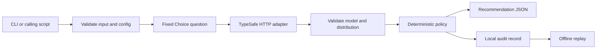
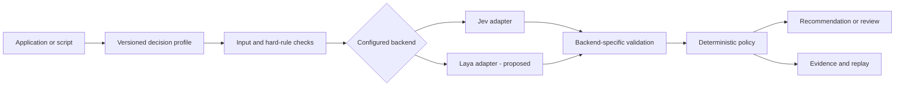

<!-- doc-governance: essential; canonical: self; checked: 2026-10-04 -->
# Jev: research and a practical harness

Research date: September 22, 2026. Primary-source research now includes Receptron's Laya repository and a bounded authenticated Jev probe. This document owns scope, research conclusions, and the proposed adoption sequence. [LIVE_RESULTS.md](LIVE_RESULTS.md) owns observed probe results and limitations; the [PRD](PRD.md) owns implementation requirements.

## Recommendation

Build one reusable decision harness with domain profiles, rather than embedding decision logic separately into each project. Use Jev for small semantic judgments; let conventional code own exact rules, validation, routing, audit, and replay. Treat Laya as a separately evaluated local backend. Begin with taxonomy, evidence review, and intent-routing profiles, which all fit the current Choice primitive. Measure usefulness on labeled data before widening each profile.

There are three different goals here:

| Goal | What the harness can establish |
|---|---|
| Valid, predictable output shape | Check every response against the permitted schema and labels; reject violations. |
| Repeatable policy decisions | The same saved response and policy must reproduce the same accept/review recommendation. |
| Repeatable, correct fresh inference | Measure repeated Jev calls and compare to independently labeled cases; do not assume either property. |

Caching an earlier answer can enforce reuse, but does not demonstrate model consistency or make a wrong answer correct. The first slice therefore provides explicit historical replay, with no hidden cache on fresh calls.

## What Jev is

Jev is TypeSafe's hosted model for typed decisions. It consumes a supplied state and questions. Its three primitives are Choice (a label plus distribution), Noul (a yes/no probability), and Score (a value across rubric levels plus distribution). It is intended for narrow judgments that software can consume directly; it does not produce ordinary prose. [Official introduction](https://docs.typesafe.ai/introduction).

For current direct access, TypeSafe documents the pinned model `jev-1.13.0`. Moving aliases can change without an application edit. The model accepts text or structured text data; images/audio require a separate preparation step. The listed direct-provider price is $0.042 per million input tokens, with no output charge, but a pilot should record actual usage and billing. These are provider-published details, not independently measured economics. [Models](https://docs.typesafe.ai/models).

The direct integration is an authenticated HTTP POST to `https://api.typesafe.ai/v1/systemone`. It takes `model`, `state`, and named `questions`; returns `model`, `answers`, and token `usage`. Choice uses a map of allowed labels and their definitions. Native SDKs are optional; the starter uses Python's standard library to minimize dependencies. [API reference](https://docs.typesafe.ai/api), [official Python SDK](https://github.com/typesafe-ai/typesafe-sdk-python), [official JavaScript SDK](https://github.com/typesafe-ai/typesafe-sdk-js).

Official access and documentation are on `typesafe.ai`, `console.typesafe.ai`, and `docs.typesafe.ai`. Search results include many independent Jev-branded sites. Their examples were not used as the integration contract. The first adapter targets TypeSafe directly; gateway integration is a separate compatibility task if that is where we have access.

## What “more deterministic” should mean

We did not find an official guarantee that identical fresh requests produce bit-identical inference. The public site emphasizes consistency, while the API documents no seed or temperature control. Pinning a model prevents an intentionally moving alias but does not freeze the provider's entire serving stack. [TypeSafe](https://typesafe.ai/), [API reference](https://docs.typesafe.ai/api).

Also, `confidence` and the probability of the chosen label are different quantities. TypeSafe derives confidence from the concentration of the distribution. Neither is a demonstrated probability of correctness on our data. Noul has no separate confidence field. [Confidence](https://docs.typesafe.ai/confidence).

Our harness should own the following behavior:

1. **Stable inputs:** use a documented field allowlist in each future integration, fixed question wording and label definitions, and canonical JSON serialization. Hash the complete request. Preserve meaningful text; do not silently remove information while normalizing it.
2. **Explicit releases:** pin the provider/model, local schema, application version, rubric, and policy. Record actual returned model identity. A model mismatch is a failure.
3. **Exact rules first:** parse and check types, identifiers, required fields, ranges, dates, and authorization in code. Call Jev only for the remaining semantic judgment.
4. **Finite outcomes:** choose explicit labels, including a review/unknown class when appropriate. Avoid asking “what should we do?” without a bounded answer space.
5. **Separate observation from action:** retain the original distribution; calculate the recommendation with declared thresholds and tie behavior. Never let a model bypass a hard rule.
6. **Replayable evidence:** save request, rubric, policy, response, mode, version, hashes, and result. Replay the recorded answer without another model call. Hashes support accidental-corruption detection, not an adversarial audit guarantee.
7. **Visible failure:** authentication, timeout, malformed answer, or recording failure returns an error. No replacement response, normalization, silent retry, or fallback model pretends that the original evaluation succeeded.

## Uses in our work

These are proposed applications, not claims about implemented integrations. They span projects and business domains. A profile owns a versioned rubric, finite answer space, allowed input fields, review behavior, and evaluation cases.

| Priority and use | Ask Jev | Keep in code | Evidence before adoption |
|---|---|---|---|
| 1. Incoming-data classification | Which category or taxonomy branch describes this record? Choice. | Schema, taxonomy versions, valid paths, review routing. | Rare-class and near-neighbor labels; measure branch errors. [Taxonomy recipe](https://docs.typesafe.ai/cookbooks/hierarchical_classification). |
| 2. Data-quality triage | Does a description support its assigned category or extracted field? | Format/range checks and exact invariants; preserve source data. | Clean, defective, and ambiguous examples; missed defects and false alarms. Proposed use of [field verification](https://docs.typesafe.ai/cookbooks/sde_cascade). |
| 3. Requirements and evidence review | Does supplied evidence support, contradict, or fail to establish one requirement? Choice. | Verify command execution, exit code, source/quote existence, and artifact presence. | Independently reviewed evidence, missing quotes, and misleading context. Extension of [citation checking](https://docs.typesafe.ai/cookbooks/citation_check). |
| 4. Task, model, or skill routing | Which registered handler fits; does any fit? Choice plus a suitability check where needed. | Registry, permissions, budgets, execution, and review. | Overlapping handlers and no-fit cases. [Routing](https://docs.typesafe.ai/patterns/intent-routing), [skill suggestion](https://docs.typesafe.ai/cookbooks/skill_suggestion). |
| 5. Retrieval admission | Is this passage relevant, usable, contradictory, or trying to instruct the consumer? Atomic Nouls. | Source permissions, retrieval, context limits, separate conflicts from supporting evidence. | Query/passage labels and missed-useful-evidence rate. [RAG recipe](https://docs.typesafe.ai/cookbooks/classifying_rag_passages). |
| 6. Search reranking | How well does each retrieved candidate answer the query? Noul or rubric Score. | Candidate retrieval, stable sorting/ties, comparison budget. | Ranking quality and recall; cannot recover a document absent from the candidate set. [Reranking](https://docs.typesafe.ai/cookbooks/rerank_typesafe). |
| 7. Candidate deduplication | Are these records the same entity, distinct, or ambiguous? | Candidate blocking, identifiers, exact comparisons, review, and merges. | Hard negative pairs and variants; pairwise judgments do not prove transitive identity. [Entity alignment](https://docs.typesafe.ai/cookbooks/entity_alignment). |
| 8. Bounded extraction | Which already-found span/value answers this question, or is none correct? Choice. | Parser/regex candidates, exact span copying, normalization, arithmetic. | Gold spans and missing candidates; selection cannot rescue absent candidates. [Extraction](https://docs.typesafe.ai/cookbooks/pre_parsed_value_extraction_cookbook). |
| 9. Moderation and message screening | Which defined hazard is present; how severe? Noul/Score. | Policy versions, thresholds, review/appeals, enforcement. | Domain/adversarial labels and false-block/false-allow costs. Never the sole security boundary. [Guardrails](https://docs.typesafe.ai/cookbooks/llm_guardrails). |
| 10. Software operations triage | Which incident category or owner fits a log excerpt? Does a change violate a semantic convention? | Parsers, test results, actual health signals, escalation and remediation. | Labeled incidents and reviewer workload. Proposed application of the [official use-case map](https://docs.typesafe.ai/concepts/use-case-map). |

For coding work, a useful extension is a completion review that evaluates each requirement against actual evidence. A command that did not run still fails our process even if Jev labels the explanation convincing. For data work, the earliest useful version is category recommendation plus a review queue, with the source record unchanged.

For SignSense Reuse Agent specifically, the existing project instructions describe a Python pipeline that extracts sign-order metadata from proof files for retrieval. Plausible profiles are checking extracted metadata against supplied text, refining category assignments, reranking retrieved candidates, and flagging possible duplicates. Jev's text-only input means a vision/PDF extraction component must supply the text or candidate fields first. These are proposed seams, not changes made to that project; its local dotenv supplied only the authorized credential for synthetic testing. No production content or database was accessed.

Avoid using Jev as the owner of exact arithmetic, date comparison, authorization, legal conclusions, or an open-ended plan. TypeSafe documents problems with counting, numerical precision, indirection, unrelated context, and adversarial state. Independently asked questions need not satisfy logical identities; thresholds tuned for Noul should not be copied to Choice. [Jev 1.13 limitations](https://docs.typesafe.ai/model-jaggedness/jev-1.13).

## Pilot architecture

The fixture adapter is an explicit development mode with synthetic responses. It exercises the same validation and policy logic. It must never be selected automatically after a live failure.

The first policy considers the selected label's probability, its margin over the runner-up, and labels that always require review. Exact ties require review. The provider's separate confidence is retained for analysis. These thresholds are initial engineering settings, not a calibrated acceptance policy. `accept` means the classification meets the configured gates; this application performs no downstream business action.

Later, add atomic Noul/Score questions only when they address a measured gap. Compose their answers with explicit code and weights from configuration. This follows TypeSafe's documented patterns while keeping ownership of the final policy local. [Patterns](https://docs.typesafe.ai/patterns).

## How we establish real improvement

**First, prove integration.** Bootstrap locally, run fixtures, inspect the audit, and replay. With provider access, perform one watched live call using a synthetic record. Check the actual model, response shape, audit, usage, and failure behavior before a batch.

**Then define a domain benchmark.** Choose one taxonomy and write explicit inclusion/exclusion rules. Have a domain owner label representative records, including rare classes, boundaries, ambiguous cases, and deliberately misleading text. Split development data from held-out evaluation data; keep duplicates and related records in the same split. Do not choose thresholds using the final test set.

**Compare useful alternatives.** Use the same held-out cases to compare existing rules/manual workflow, Jev, and an existing model if relevant. Track accuracy by class, false acceptance, review rate, review time, request latency, and actual usage. Report selective accuracy alongside coverage so a system that reviews everything cannot appear to have solved the problem.

**Measure consistency separately.** On a bounded set, repeat identical requests with our own caching disabled and record label agreement, full-distribution change, and policy-decision agreement. Provider-side caching may remain unobservable. Also test harmless paraphrases and field ordering as distinct experiments. Repeat after an explicit model/rubric change. Historical replay is not this experiment.

TypeSafe's own consistency cookbook shows label flips: its reported example moves from 90.8% raw agreement to 99.2% after a gate, with automatic labels on 74.2% of answers. Those are results from that provider experiment, not a promise for ours. It varies a throwaway `uid`, so it cannot isolate identical-request inference variation from sensitivity to the extra field. [Consistency cookbook](https://docs.typesafe.ai/cookbooks/consistency_choice_cookbook).

**Calibrate before automating.** Use held-out probability bins, Brier score or log loss, and reliability plots when adding calibration analysis. Tune thresholds on development data and report uncertainty on a separate test set. A small sample with zero observed errors does not establish zero risk. Choose acceptable false-acceptance and review budgets from the business consequences rather than a generic confidence value.

**Deploy in stages.** Begin in shadow mode; a person compares recommendations to real decisions. Permit only a bounded reversible workflow after results meet the agreed targets. Expand volume only after the manual run has been watched. Every scheduled or broader rollout is a later operational decision, not part of this starter.

## Laya repository assessment

The requested [Receptron repository](https://github.com/receptron/laya/tree/6478649e723122ca24bbf5fb69ed1010023c9750) is a Node.js/TypeScript ONNX runner for Convai Innovations' Laya model. It is a distinct model with Jev-like types, not an open-weight copy of Jev. The source review used adapter commit `6478649e723122ca24bbf5fb69ed1010023c9750`, package version 0.1.2. The ONNX bundle reviewed was revision `68f27dfe5a27a54fb2b1fefc432f43f972e90868`; the upstream model family was revision `1c5edc17a7acd8701df6fc341c0d179f1c62c982`. These are review pins, not an installation performed here.

| Dimension | Jev direct API | Reviewed Receptron Laya default |
|---|---|---|
| Execution | Hosted TypeSafe service. | Local Node.js, ONNX Runtime; CPU default. |
| Operational control | Pin requested model; provider operates serving stack. | Can pin weights, tokenizer, calibration, runtime, and execution provider. |
| Data movement | Supplied state is sent to TypeSafe. | Local inference can keep state on the host after provisioning artifacts. |
| Cost shape | Metered input tokens. | Hardware, memory, energy, deployment and maintenance; not economically free. |
| Compatibility | Native typed API. | Similar semantic primitives; adapter and metadata translation required. |
| Current verification here | Bounded live Choice probe; see results. | Source and model-card review only; no installation, weights, or inference. |

The manifest requires Node >=20 and uses dependency ranges. The reviewed lockfile resolves ONNX Runtime 1.30.0 and tokenizers 0.2.0. An adoption build should preserve a reviewed lockfile and pin the runtime and artifacts. The package is labeled MIT; model publishers identify weights as Apache 2.0. These are upstream license identifiers, not a licensing audit. [Manifest](https://github.com/receptron/laya/blob/6478649e723122ca24bbf5fb69ed1010023c9750/package.json), [lockfile](https://github.com/receptron/laya/blob/6478649e723122ca24bbf5fb69ed1010023c9750/yarn.lock), [package license](https://github.com/receptron/laya/blob/6478649e723122ca24bbf5fb69ed1010023c9750/LICENSE), [ONNX bundle](https://huggingface.co/receptron/laya-onnx/tree/68f27dfe5a27a54fb2b1fefc432f43f972e90868).

### Material findings

1. **Default loading does not meet our reproducibility rule.** The loader follows `main`, checks cached file sizes rather than hashes, and may use a populated cache after a failed HEAD request. It downloads files individually. We should provision one immutable bundle with a checksum manifest and then use `modelDir`, which bypasses downloads. Constrain paths and require bounded downloads in that provisioning command. [Loader source](https://github.com/receptron/laya/blob/6478649e723122ca24bbf5fb69ed1010023c9750/src/download.ts).

2. **Silent truncation conflicts with our no-partial-result rule.** The default English sequence budget is 512 tokens per question including its header, with a 192-token header budget. Instructions, option descriptions, and state can be shortened without a truncation result. A wrapper must tokenize the actual sequence and reject overflow before inference. Keep labels few and inputs short. Do not silently inherit this behavior. [Sequence builder](https://github.com/receptron/laya/blob/6478649e723122ca24bbf5fb69ed1010023c9750/src/sequence.ts).

3. **Matching field names are not matching semantics.** Laya applies calibration temperatures, computes confidence from normalized entropy, rounds values to four decimals, and returns a learned `act_probability` field. Jev's confidence definition is not established to be identical. Laya reports model identity merely as `laya`; our audit must add artifact/runtime hashes. Its simpler criteria types do not cover every structured Jev input. Use separate thresholds and reject unsupported inputs. [Inference](https://github.com/receptron/laya/blob/6478649e723122ca24bbf5fb69ed1010023c9750/src/laya.ts), [types](https://github.com/receptron/laya/blob/6478649e723122ca24bbf5fb69ed1010023c9750/src/types.ts).

4. **The default model is not the benchmark-specialized model.** The upstream card reports typed-decisions accuracy of 0.362 for base English against a 0.461 majority baseline. The 0.766 result belongs to a checkpoint fine-tuned on that benchmark's training split. It also warns about overconfident outputs and poor non-English behavior for the English checkpoint. Its Jev comparisons are third-party figures, not a head-to-head experiment by the authors. These are publisher-reported findings, not our measurements. [Upstream model card](https://huggingface.co/convaiinnovations/laya#honest-limits).

5. **Published bundle and tests are narrower than family-level claims.** The reviewed ONNX tree contains the English bundle; the README's multilingual option is not evidence that such a folder exists there. The external weight data is about 1.7 GB. We did not establish the precise upstream revision used for that export. The model-backed test compares one example to Laya's Python implementation and skips without weights; CI runs without the weights. Neither establishes equivalence to Jev. [Bundle tree](https://huggingface.co/receptron/laya-onnx/tree/68f27dfe5a27a54fb2b1fefc432f43f972e90868), [model test](https://github.com/receptron/laya/blob/6478649e723122ca24bbf5fb69ed1010023c9750/test/test_model.ts), [CI](https://github.com/receptron/laya/blob/6478649e723122ca24bbf5fb69ed1010023c9750/.github/workflows/ci.yml).

### Where Laya could help

Our inference: Laya is most interesting for short local classifications, sensitive on-premise text, offline operation, and high-volume workloads where running our own model is justified by measured quality and total cost. Local artifacts give us more control over the execution environment. No sampling step appears in the reviewed inference path, but cross-hardware bitwise reproducibility is unproven. It remains necessary to test the exact checkpoint and runtime we would deploy.

I would not select the default checkpoint as a general Jev replacement from these sources. I would benchmark it as a second backend on a small taxonomy and representative English records, then decide whether a specialized checkpoint or fine-tuning is warranted. Every claimed improvement needs the same test set and recorded engine identity.

## Reusable harness scope

The next design should preserve one local request/result contract while selecting the backend explicitly. The current Jev validator intentionally rejects a `laya` response; implementing Laya means adding a separate adapter, not weakening that check. A calling script invokes the CLI or library directly, with no model acting as the connection between components.

Proposed stages:

1. **Profile library:** taxonomy, evidence support, and task routing; each has source-field selection, rubric, expected labels, and policy. This broadens reuse without changing engines.
2. **Evaluation:** a representative labeled corpus, fixed development/test splits, repeat/paraphrase/adversarial cases, selective accuracy, review workload, and calibration analysis. Gate promotion on business-specific targets.
3. **Laya adapter:** a shipped bootstrap command, immutable bundle and runtime pins, checksum verification, explicit token-budget rejection, source-preserving serialization, and full provenance. Start in comparison/shadow mode.
4. **Noul/Score and multi-question profiles:** introduce per-primitive validation and separately tuned policies. Combine atomic judgments using code-owned formulas and configured weights.
5. **Application integration:** a caller maps a recommendation to its own permitted actions; uncertainty and backend failure remain explicit. No hidden fallback or unattended schedule is implied.

This would support SignSense and other projects through configuration rather than copied prompts and ad hoc glue. Backend selection is an operator choice. If routing between engines is later useful, make it an explicit, versioned policy with its own evidence; a provider failure must not silently change engines.

## Current scope and remaining decisions

The supplied starter implements Choice classification, configurable policy, audit/replay, and basic labeled evaluation. `probe_live.py` now adds a bounded synthetic live experiment, and `analyze_probe.py` derives repeat and timing observations from its saved evidence without network calls. It does not implement a general calibration suite, Noul/Score adapters, Laya runtime, a human-review interface, caching, or production connectors.

TypeSafe access is now confirmed. The next decision is which domain profile and independently labeled dataset should establish useful quality, followed by whether local execution justifies a Laya benchmark. Credentials remain in the authorized dotenv/environment path. See [README.md](../README.md) for commands, [LIVE_RESULTS.md](LIVE_RESULTS.md) for the live probe, and [walkthrough](walkthrough.md) for implementation evidence.
