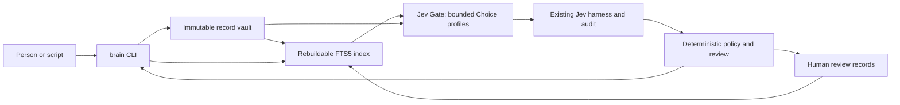

<!-- doc-governance: essential; canonical: self; checked: 2026-10-04 -->
# Jev Brain — product and system requirements

Status: build plan, September 23, 2026. No second-brain application has been implemented. This document owns the product scope, architecture, and requirements. [implementation_plan.md](implementation_plan.md) owns proposed file changes; [task_checklist.md](task_checklist.md) owns execution status; [agent_prompt.md](agent_prompt.md) is the handoff brief.

## Executive summary

Build **Jev Brain**, a local-first, single-user knowledge system that captures work notes, retrieves the original evidence, and records decisions about that evidence. Jev is its bounded semantic decision center: it recommends a note type and judges whether a retrieved passage addresses a question. Conventional code owns storage, search, provenance, source permissions, review rules, and every action. The first release returns cited candidate passages and flags passages that dispute a premise in the query; it does not generate prose or act autonomously.

The product should make a useful path work before adding connectors: a person can capture a real text note, find it without network access, run an explicitly authorized Jev judgment, inspect the probability distribution and audit, and replay the saved recommendation. Later phases can add a decision workbench, source connectors, and optional synthesis after separate evidence gates.

## Verified current state

| Claim | Evidence and implication |
|---|---|
| The existing standalone harness supports one Choice question per request, pinned model validation, deterministic accept/review policy, append-only per-call audits, and offline replay. | [`jev_harness.py`](../../jev_harness.py), especially `validate_config`, `build_request`, `validate_response`, `decide`, `run_one`, and `replay`. Reuse these functions; do not create a second Jev transport or probability validator. |
| A bounded live probe used `jev-1.13.0` on 13 synthetic calls: 13 matched predeclared labels, 10 accepted and 3 reviewed. Two repeat groups had equal saved distributions. | [Live results](../LIVE_RESULTS.md) and its linked raw evidence. This proves the exercised integration shape, not knowledge-domain accuracy, calibration, universal determinism, or security against injection. The existing `0.9` probability and `0.2` margin settings are illustrative and must not become this product's thresholds. |
| TypeSafe's current Jev API accepts text/structured-text `state` plus typed Choice, Noul, and Score questions and returns typed answers. It is not a memory store or prose generator. | [Introduction](https://docs.typesafe.ai/introduction), [API reference](https://docs.typesafe.ai/api), and [models](https://docs.typesafe.ai/models). The pinned version currently documented is `jev-1.13.0`; aliases can move. |
| TypeSafe's RAG cookbook judges query–passage pairs before code routes evidence and conflicts. Its example is from Jev 1.12 and its injection score is expressly not a security boundary. | [Classifying RAG passages](https://docs.typesafe.ai/cookbooks/classifying_rag_passages). Use the architecture pattern, not its unvalidated numbers. |
| This machine has Python 3.14.6 and SQLite 3.50.4 with FTS5 available. | Planning commands and unedited output in [planning-preflight.txt](evidence/planning-preflight.txt). A new machine must check FTS5 at startup rather than assume it. |
| Receptron's Laya is a separate local ONNX implementation with Jev-compatible request concepts, not the hosted Jev model or a proven equivalent. | [Prior research](../RESEARCH.md) and [Laya repository](https://github.com/receptron/laya). It is a separately benchmarked future backend, not a silent fallback. |

## Scope and release boundary

The plan extends the standalone `outputs/jev-harness` deliverable as a generic application. It does not integrate SignSense or depend on that repository's business logic. Its only proposed reuse of the SignSense dotenv is an operator-selected credential path for a bounded live test; the key must never enter source, output, or an audit.

**Release 1 (build target):** local CLI and vault; text record capture; literal full-text search; two independently versioned Choice profiles (`triage` and `passage_evidence`); explicit provider egress; immutable record and inference evidence; human review of triage; citation-checked candidate evidence recall; offline replay; bounded fixture demo and evaluation. Search and capture work without a credential. Each profile requires its own watched synthetic live request before it processes real notes.

**Later, conditional phases:** a structured human decision ledger with Jev scoring of supplied options; one source connector at a time with provenance and permission mapping; optional cited prose synthesis; optional Laya local backend. Each phase requires its own tests and representative evaluation before automatic use.

Non-goals for Release 1: background scanning, recursive import, scheduling, email or external tool actions, a knowledge graph, embeddings, auto-created tasks, automatic deletion or revision of source text, multi-user hosting, and a claim of factual truth based on Jev confidence. No financial, legal, medical, or other high-stakes decision is automated.

Assumptions awaiting the user's optional preference: first content is work/project knowledge and the first interface is a local CLI. This choice minimizes new permissions and lets the user test the decision center against inspectable notes. Changing the content domain or hosting target changes the trust and connector plan, not the central Jev contract.

### Delivery roadmap

| Milestone | User outcome | Jev judgment | Exit gate before expanding |
|---|---|---|---|
| 1. Capture and recall | Save work notes, locate originals, inspect candidate evidence and explicit query-premise conflicts. | Note type and query–passage evidence class, each from a finite Choice rubric. | Fresh fixture demo, one watched synthetic call per profile before its live use, exact citations, explicit egress, and diagnostic retrieval/Jev metrics. |
| 2. Decision ledger | Ask “what did we decide?” and compare a bounded set of options against cited notes; record the human's final choice and rationale. | Separate atomic judgments for option fit, cross-record conflict, evidence support, and uncertainty; code combines them with stated constraints. | Independently labeled decision cases, human-review workload, and no automatic external action. |
| 3. Source expansion | Bring in one authorized source at a time, such as selected project files, Git history, or SignSense reference metadata. | Triage and relevance on selected text only. | Source-native permissions, change/version provenance, egress mapping, bounded watched sync, and rebuildable local cache. |
| 4. Presentation options | Offer cited prose or a local inference backend if they materially improve use. | Jev still gates evidence/decisions; Laya is an explicit separately benchmarked backend. | Claim-level citation tests for prose; pinned Laya artifacts and same-corpus quality/overflow comparison for local inference. |

Milestones 2–4 are design direction, not Release 1 acceptance criteria. Each adds a new runnable command only after the prior path is working.

## Architecture and flow

1. `brain init` creates all non-secret vault state and fixture material in an absent or empty directory; `brain demo` exercises the entire synthetic capture → search → Jev recommendation → replay path. Neither needs a credential.
2. `brain record add` saves UTF-8 text with a stable record ID, content hash, provenance, project, and egress class. A correction is a new immutable record that cites the prior record through `supersedes_record_id`; no text is overwritten. The original text remains canonical.
3. `brain index rebuild` derives a SQLite FTS5 projection from current records and verified human review records. `brain find` searches locally with a stable record-ID tie break. The index can be removed and rebuilt without knowledge loss.
4. `brain classify` submits one eligible record and its exact hash to the existing harness using the `triage` Choice profile. Jev suggests `task`, `decision`, `reference`, `idea`, or `unclear`. The caller sees the whole distribution, policy result, source record ID/hash, and audit ID. The application does not turn an unreviewed suggestion into a canonical fact.
5. `brain recall` applies the provider-eligibility filter within local FTS5 search, takes at most `top_k` eligible matches, and asks the `passage_evidence` Choice question about each query–passage pair. Separately it counts all matching `local_only` records so the limited scope is visible. The finite outcomes are `evidence`, `premise_conflict`, `context`, `irrelevant`, and `unclear`. `premise_conflict` means the passage disputes a factual premise explicitly stated in the query; a single-passage call cannot detect disagreement between two notes. Code checks exact source IDs and text spans, then displays **provisional** candidate-evidence and query-premise-conflict groups, each with its distribution and `review_required` status. It never calls an answer generator in Release 1.
6. `brain review resolve` records the person's triage label and reason against one exact record hash and inference audit. Review is new immutable evidence; a later superseding record does not inherit the old label. `brain replay` recomputes the saved policy from the saved provider response without a new provider call.

The **Jev Gate** is the only inference component. The CLI calls each component directly. Jev never connects components, grants access, computes dates, executes commands, or decides whether a source may leave the machine. The source text is always untrusted data, even if Jev judges it non-injective.

### Ownership and recovery

| Fact | Canonical owner | Rebuildable derivative |
|---|---|---|
| User-captured text, provenance, egress class, supersession link | Immutable `vault/records/<id>.json` | Search row, display export |
| Provider request, model answer, usage, historical recommendation/failure | Existing harness audit under `vault/inference/` | Summary, current suggestion view |
| Human triage resolution and reason | Immutable `vault/reviews/<id>.json` | Current label in search view |
| Active operator configuration and profile rubrics | Immutable `vault/config/versions/<id>.json` plus append-only `vault/config/activations/<id>.json` selecting the current version | In-memory harness config; historical snapshots in audit |
| External source content in later phases | Its source system | Explicitly labeled local snapshot and index |

`brain doctor` detects incomplete writes, missing/stale index, invalid audit links, and supersession cycles. `brain index rebuild` creates a fresh index in a scratch path, verifies it against records, and atomically selects it; the previous derived index stays available until verification completes. `brain config set` creates a new immutable configuration version and activation event instead of overwriting a file. No Release 1 command destroys or overwrites a canonical record. Any later destructive migration must first demonstrate backup restoration into a scratch vault.

## Requirements

| ID | Requirement | Priority | Verification |
|---|---|---|---|
| FR-01 | A shipped `brain demo --mode fixture` initializes an empty vault and completes capture, search, triage, recall, and replay with synthetic text; `brain init` refuses to overwrite populated state. | Required | Fresh-directory CLI transcript; repeat-init negative check. |
| FR-02 | Capture and local FTS5 search work on real bounded UTF-8 text without a provider key; every hit resolves to its canonical record and current supersession state. | Required | Real local note smoke; known-query and no-match cases; index rebuild equivalence. |
| FR-03 | Two active, versioned Choice profiles define finite labels and rubrics in configuration. The Jev Gate reuses `jev_harness.run_one`/`replay`, validates pinned model and response, and ties every observation to an exact record or query–passage hash. In Release 1, even a harness `accept` remains a recommendation until human review. | Required | Mock/fixture and one bounded live synthetic call per profile; altered hash/model rejection. |
| FR-04 | A hosted request occurs only when both the invocation explicitly allows provider use and every selected record is marked provider-eligible. The output states the eligible scope and excluded count. Local-only text never enters a request or audit. | Required | Mock transport captures payload; mixed-eligibility and missing-consent checks. |
| FR-05 | `brain recall` retrieves at most configured `top_k` provider-eligible FTS5 matches and separately counts all matching local-only records. It presents exact source passages as **provisional** candidate evidence or query-premise conflict with `review_required`; irrelevant suggestions remain visible in a lower-priority inspected list. It explicitly reports no matches, no eligible matches, or zero candidate-evidence passages. It never claims the corpus has no answer or produces prose from missing evidence. Cross-record semantic conflict detection is out of scope. | Required | Retrieval/evidence integration cases; local-only high-rank, invalid span, false-premise, and provisional-status checks. |
| FR-06 | Provider, configuration, index, and write failures return a nonzero status, safe error code, named next action, and any available audit reference. A failed semantic stage cannot be rendered as successful recall. | Required | Simulated 401/429/timeout/malformed response/disk failure; no-silent-fallback checks. |
| FR-07 | A person can resolve triage against one immutable record and inference; replay reproduces the saved recommendation without an API call; superseding a record makes its old recommendation historical. | Required | Review, replay, supersession, and stale-resolution checks. |
| FR-08 | A dry run lists exact fields, record IDs, destination, and maximum calls before live use; the shared gate requires a completed same-config synthetic smoke for each profile before ordinary live classification, recall, or evaluation. Later batches are sequential and bounded. No schedule is enabled. | Required | Dry-run, absent/failed/stale smoke, and call-count checks. |
| FR-09 | A shipped offline evaluator measures FTS5 candidate recall against gold source IDs/spans in the full corpus split, separately from Jev triage/evidence quality on labeled pairs; it reports counts, denominators, and dev/holdout provenance. | Required | Split-aware corpus and report verification. |
| NFR-01 | Configuration owns paths, key name, mode, profile/rubric, `top_k`, byte limits, timeout, and review settings; code owns valid ranges and rejects unknown or invalid values. No secret is printed or persisted. | Required | Boundary and secret-redaction tests. |
| NFR-02 | The runtime and provider model are pinned for Release 1; no dependency resolves to `latest`. Historical replay records model/profile/policy versions and does not claim fresh-call determinism. | Required | Version-file/manifest inspection and replay test. |
| NFR-03 | Every default flow has a shipped command from empty state; local single-user access uses OS file permissions and documents that live Jev sends selected text to TypeSafe. | Required | Fresh vault test, file-permission inspection, payload inspection. |

## Proposed technical contracts

The existing [TypeSafe API reference](https://docs.typesafe.ai/api) owns the network contract. Release 1 calls its pinned `jev-1.13.0` model with one Choice question per request through the existing harness. The app's profile config supplies the question ID, instructions, criteria, and policy; no TypeSafe alias is accepted. The [model limits](https://docs.typesafe.ai/models) are an upper bound, not a reason to send whole documents: the app uses smaller configured byte and candidate limits and rejects oversize input rather than truncating it.

Each CLI command emits one JSON result envelope with `schema_version`, `operation`, `status`, and relevant IDs. Local no-match, no provider-eligible match, and Jev candidates requiring review are distinct statuses; a zero candidate-evidence count is explicit. An error includes `code`, `message`, `next_action`, and available audit IDs; it never includes the key or provider response body. Proposed values are specified in [implementation_plan.md](implementation_plan.md), then frozen by tests before coding consumers against them.

Provider mode is explicit (`fixture` or `live`), with no automatic fixture/local fallback. The credential comes from the configured environment variable or one operator-selected dotenv file read as a literal value by the already tested `probe_live.read_key` helper. The `.env` path is configuration, not source; only the chosen key enters the process and it is removed afterward. A direct provider call is bounded by the existing harness timeout and produces its own append-only audit. The application stores pointers, not a duplicate answer copy.

## File impact

The proposed Release 1 files are listed once, with symbols and dependency order, in [implementation_plan.md](implementation_plan.md). The application root is `outputs/jev-harness`; all paths there are relative to that root. Existing harness code and probe evidence remain usable. The current plan packet is the only set of files created at this stage.

## Success criteria and evaluation gate

Release 1 is functionally complete only with command output for a fresh fixture demo, local real-text search, exact index rebuild, replay, mixed-egress refusal, missing-key/provider failure, review/supersession, and one watched synthetic live call per profile before that profile's real use. An evaluator must report candidate recall against gold sources from the full split separately from Jev's filtering. An offline corpus can establish plumbing; it cannot establish domain quality.

Before any automatic category acceptance or prose answer is enabled, create an independently adjudicated representative corpus grouped by scenario family. Freeze profile versions and policy thresholds on a development split, then evaluate a held-out split without tuning against it. Report accepted-label errors and coverage, useful-evidence retention, irrelevant admission, false-sufficient counts if a sufficiency profile is later added, citation validity, exact-repeat drift, paraphrase stability, injection variants, review load, latency, and token usage with numerators/denominators. The user or domain owner sets an error budget after seeing the pilot; no numerical accuracy target is invented from the 13 synthetic calls. Hard invariants are zero invalid citations, zero unauthorized provider requests, and zero success-shaped provider failures in the test suite.

## Risks and mitigations

| Risk | Impact | Mitigation or decision |
|---|---|---|
| Hosted egress of sensitive notes | High | Default record egress `local_only`; explicit record eligibility and per-invocation consent; inspect dry-run payload fields. A local vault is not local inference. |
| Fluent but unsupported answer | High | Release 1 emits source passages, not synthesized prose; exact ID/span checks and a visible no-evidence state. |
| High probability mistaken for truth | High | Save full distributions, treat thresholds as policy only, measure with independent labels, and keep review path. [Confidence semantics](https://docs.typesafe.ai/confidence). |
| Search misses evidence before Jev sees it | Medium | Measure FTS5 candidate recall separately; compare Jev gate against lexical baseline. |
| Stale or conflicting records | Medium | Immutable supersession links and current-record projection. Release 1 can flag a query-premise conflict but cannot detect disagreement between two records; add pairwise review in the decision-ledger phase. |
| Prompt injection in captured text | High | Treat source text as data, enforce egress/permissions in code, and never execute instructions from it. A model can still be influenced; even a future injection score is not a security boundary. |
| Partial filesystem or index failure | Medium | Atomic immutable writes, explicit failures, `doctor`, and tested index regeneration before replacement. |
| Live model drift or Laya mismatch | Medium | Pinned model/profile, actual model validation, saved replay, separate Laya benchmark before any provider switch. |

## References

Internal: [harness research](../RESEARCH.md), [live probe](../LIVE_RESULTS.md), and [harness README](../../README.md). External: [TypeSafe introduction](https://docs.typesafe.ai/introduction), [API](https://docs.typesafe.ai/api), [models](https://docs.typesafe.ai/models), [confidence](https://docs.typesafe.ai/confidence), [Jev limitations](https://docs.typesafe.ai/model-jaggedness/jev-1.13), [RAG passage cookbook](https://docs.typesafe.ai/cookbooks/classifying_rag_passages), and [Receptron Laya](https://github.com/receptron/laya).
